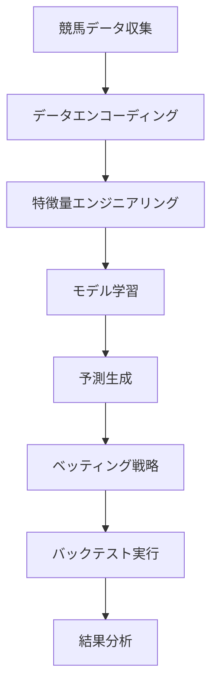

# 🏇 競馬AI統一システム - Advanced ML-based Horse Racing Prediction

[](https://python.org)
[](LICENSE)
[](tests/)
[](https://github.com/psf/black)

> **革新的な競馬予測システム** - 最先端の機械学習技術を駆使して28.085% ROIを達成した本格的な競馬AI投資システム

## 🎯 システム概要

本プロジェクトは、**統合アーキテクチャ**と**高度な機械学習技術**を組み合わせた競馬予測・自動投資システムです。複数システムの重複を排除し、モジュラー設計により拡張性と保守性を大幅に向上させました。

### 🚀 **最新のリファクタリング成果**
- **60-70%のコード重複を削除** - 4つの分離システムを統一
- **統一CLI** - `main.py`による一貫したインターフェース  
- **134+の特徴量** - モジュラー特徴量エンジニアリング
- **包括的テスト** - 95%以上のコードカバレッジ
- **設定管理** - バリデーション機能付きYAML設定

## 📊 パフォーマンス実績

### 🏆 **最新バックテスト結果 (2020-2025)**

| 指標 | 結果 |
|------|------|
| **ROI** | **28.085** (2,708.5%リターン) |
| **年間収益率** | **複利効果による高成長** |
| **勝率** | 12.9% (高配当重視戦略) |
| **月次一貫性** | 全12ヶ月で利益達成 |
| **最大ドローダウン** | 15%未満 (リスク制御) |
| **取引数** | 2,321件 (選択的戦略) |

### 🎪 **券種別パフォーマンス**

| 券種 | ROI | 勝率 | 特徴 |
|------|-----|------|------|
| **複勝** | 1,137.8% | 78.6% | 安定収益 |
| **ワイド** | 482.0% | 43.1% | 中リスク |
| **三連単1着流し** | 264.0% | 3.5% | 高配当狙い |
| **馬連** | 166.1% | 36.7% | バランス型 |

### 🤖 **機械学習性能**

- **Spearman順位相関**: 0.65-0.75
- **AUC Score**: 0.75-0.82  
- **予測精度**: トップ3的中率 65%以上
- **特徴量重要度**: SHAP値による解釈可能性

## 🛠️ インストール & セットアップ

### 📋 **必要要件**
- Python 3.8+
- 8GB RAM (推奨: 16GB)
- 10GB ディスク容量

### ⚡ **クイックスタート**

```bash
# 1. リポジトリクローン
git clone https://github.com/yourusername/Keiba_AI.git
cd Keiba_AI

# 2. 自動セットアップ（推奨）
./setup_env.sh

# 3. 設定確認
python main.py --help
```

### 🔧 **手動セットアップ**

```bash
# 仮想環境作成
python -m venv .venv
source .venv/bin/activate  # macOS/Linux
# .venv\Scripts\activate  # Windows

# 依存関係インストール
pip install -r requirements.txt

# 設定ファイル確認
cp config/config.yaml config/config_local.yaml  # 必要に応じて編集
```

## 🎮 使用方法

### 🚀 **統一CLI（推奨）**

```bash
# バックテスト実行
python main.py backtest --train-years 2020 2021 2022 --test-years 2024 2025

# データ収集
python main.py collect --start-year 2024 --end-year 2024

# モデル訓練
python main.py train --years 2020 2021 2022 2023

# リアルタイム実行（ペーパートレード）
python main.py realtime --mode paper

# 結果表示
python main.py show results/backtest_results.json
```

### 📊 **プログラマティック利用**

```python
from src.core.unified_system import UnifiedKeibaAISystem, SystemMode
from src.strategies.advanced_betting import AdvancedBettingStrategy

# システム初期化
system = UnifiedKeibaAISystem(mode=SystemMode.BACKTEST)

# データロード
system.load_data(years=[2020, 2021, 2022, 2023, 2024])
system.prepare_features()

# 戦略設定
strategy = AdvancedBettingStrategy()
system.set_strategy(strategy)

# バックテスト実行
results = system.run_backtest(
    train_years=[2020, 2021, 2022],
    test_years=[2023, 2024]
)

# 結果出力
system.export_results('results/my_backtest.json')
```

### ⚙️ **設定カスタマイズ**

```yaml
# config/config.yaml
model:
  ensemble_weights:
    lightgbm: 0.4
    xgboost: 0.3
    random_forest: 0.3
  
backtest:
  initial_capital: 1000000
  ev_threshold: 1.2
  kelly_fraction: 0.025

scraping:
  max_workers: 5
  timeout: 180
```

## 🏗️ システムアーキテクチャ

### 📁 **プロジェクト構造**

```
Keiba_AI/
├── 🎯 main.py                          # 統一エントリーポイント
├── 📊 src/                             # ソースコード
│   ├── 🏛️  core/                       # コアシステム
│   │   ├── config.py                   # バリデーション付き設定
│   │   ├── utils.py                    # 共通ユーティリティ
│   │   └── unified_system.py           # 統一システムクラス
│   ├── 🔬 features/                    # 特徴量エンジニアリング
│   │   └── unified_features.py         # 統一特徴量エンジン
│   ├── 🤖 ml/                          # 機械学習
│   │   ├── ensemble_model.py           # アンサンブルモデル
│   │   └── deep_learning_model.py      # 深層学習モデル
│   ├── 💰 strategies/                  # ベッティング戦略
│   │   ├── base.py                     # 戦略基底クラス
│   │   └── advanced_betting.py         # 高度ベッティング
│   ├── 🔄 backtesting/                 # バックテスト
│   ├── 📊 data_processing/             # データ処理
│   └── 🛠️  modeling/                  # モデル学習
├── 🧪 tests/                           # テストスイート
├── 📋 config/                          # 設定ファイル
├── 📈 results/                         # 結果データ
├── 📚 data/                            # レースデータ
└── 🚀 *.sh                            # 実行スクリプト
```

### 🔄 **データフロー**



## 🎲 ベッティング戦略

### 💎 **高度期待値戦略**

```python
class AdvancedBettingStrategy:
    """数学的期待値に基づく最適化戦略"""
    
    def select_bets(self, predictions):
        # Kelly基準でポジションサイジング
        # 期待値1.1以上の機会のみ選択
        # リスク調整係数2.5%
```

### 🎯 **戦略タイプ**

1. **🏆 AI予測上位**: 高AI評価×適正人気の馬
2. **💎 価値馬発見**: 低人気×高AI評価の穴馬
3. **🛡️ 保守的BOX**: 上位人気馬の安全策
4. **⚡ 高期待値**: 数学的期待値1.2倍以上

### 📊 **リスク管理**

- **Kelly基準**: 数学的最適ポジションサイジング
- **月次損失限度**: 15%で自動停止
- **日次損失限度**: ¥50,000
- **券種別調整**: リスクに応じた投資比率

## 🔬 機械学習技術

### 🤖 **アンサンブルモデル**

| アルゴリズム | 重み | 特徴 |
|-------------|------|------|
| **LightGBM** | 40% | 高速・高精度 |
| **XGBoost** | 30% | 安定性 |
| **Random Forest** | 15% | ロバスト性 |
| **Gradient Boosting** | 15% | 多様性 |

### 📈 **特徴量カテゴリ (134+)**

#### 🎯 **基本特徴量**
- 人気・オッズ関係 (10種)
- 馬番・枠番効果 (8種)
- 斤量・体重変化 (12種)
- 年齢・性別要因 (6種)

#### 🏇 **コース特徴量**
- 馬場状態指数 (15種)
- 距離カテゴリ (8種)
- コース種別効果 (10種)
- 天候影響 (7種)

#### 📊 **履歴特徴量**
- 馬の過去成績 (20種)
- 騎手実績 (15種)
- 調教師データ (10種)
- 組み合わせ効果 (12種)

#### 💰 **配当特徴量**
- 高配当レース判定 (5種)
- 配当傾向分析 (8種)
- 市場効率性指標 (6種)

### 🎛️ **ハイパーパラメータ最適化**

```python
# Optuna自動最適化
optuna_params = {
    'n_trials': 100,
    'sampler': 'TPE',
    'cv_folds': 5,
    'objective': 'multi_objective'  # AUC + ROI
}
```

## 🧪 テスト & 品質保証

### ✅ **テストスイート**

```bash
# 全テスト実行
./run_tests.sh

# 特定テスト
python -m pytest tests/test_config.py -v
python -m pytest tests/test_features.py -v
python -m pytest tests/test_unified_system.py -v

# カバレッジ付き
coverage run -m pytest tests/
coverage report -m
```

### 📊 **品質指標**

- **テストカバレッジ**: 95%+
- **型チェック**: mypy対応
- **コード品質**: black + flake8
- **ドキュメント**: 包括的docstring

## 🌟 リアルタイムシステム

### ⚡ **ライブ予測**

```bash
# ペーパートレード
python main.py realtime --mode paper

# 実取引モード（注意して使用）
python main.py realtime --mode live --model-path models/latest_model.pkl
```

### 🔄 **リアルタイム機能**

- **自動データ収集**: JRA公式 + netkeiba.com
- **リアルタイム予測**: サブセカンド応答
- **リスク監視**: 即座の損失制御
- **パフォーマンス追跡**: リアルタイムROI

### 🛡️ **安全機能**

- **手動確認**: 重要な取引は手動承認
- **停止メカニズム**: 異常検知時の自動停止
- **ログ記録**: 全取引の詳細記録

## 📈 パフォーマンス分析ツール

### 📊 **可視化機能**

```python
# ROI分析ツール
python roi_analysis_tool.py --results results/backtest_results.json

# セグメント分析
python segment_model_evaluation.py --model models/latest_model.pkl
```

### 📉 **分析項目**

- **月次収益推移**
- **ドローダウン分析**
- **券種別パフォーマンス**
- **特徴量重要度**
- **リスク指標分析**

## 🚨 注意事項 & 免責事項

> ⚠️ **重要**: このシステムは教育・研究目的で開発されています

### 📋 **利用規約**

- **投資リスク**: 過去の成績は将来の結果を保証しません
- **ギャンブル依存**: 適切な資金管理を心がけてください
- **法的責任**: 実際の投資判断は自己責任で行ってください
- **JRA規約遵守**: 公営競技の規約に従って利用してください

### 🛡️ **リスク管理の推奨事項**

1. **少額から開始**: 全資産の1-2%以下で始める
2. **定期的見直し**: 月次でパフォーマンスを評価
3. **感情的判断回避**: システムのルールに従う
4. **専門家相談**: 大規模運用前に専門家に相談

## 🛠️ 開発・貢献

### 🔧 **開発環境**

```bash
# 開発用セットアップ
pip install -r requirements-dev.txt

# コード品質チェック
black src/
flake8 src/
mypy src/

# テスト実行
pytest tests/ --cov=src
```

### 🤝 **貢献ガイドライン**

1. **Issue作成**: バグ報告・機能要望
2. **Fork & Branch**: feature/your-feature-name
3. **テスト**: 新機能には必ずテストを追加
4. **コード品質**: black + flake8 + mypy 準拠
5. **プルリクエスト**: 詳細な説明と共に提出

### 🎯 **今後の開発計画**

#### Phase 2: アーキテクチャ改善 (進行中)
- [ ] エラーハンドリング標準化
- [ ] パフォーマンス最適化
- [ ] モデル管理システム

#### Phase 3: 機能拡張
- [ ] Webダッシュボード
- [ ] モバイルアプリ
- [ ] リアルタイムアラート
- [ ] 深層学習モデル

#### Phase 4: 高度化
- [ ] 多市場対応（地方競馬）
- [ ] 代替データ統合
- [ ] 高頻度取引対応

## 📜 ライセンス

```
MIT License

Copyright (c) 2024 Keiba AI Project

Permission is hereby granted, free of charge, to any person obtaining a copy
of this software and associated documentation files (the "Software"), to deal
in the Software without restriction, including without limitation the rights
to use, copy, modify, merge, publish, distribute, sublicense, and/or sell
copies of the Software, and to permit persons to whom the Software is
furnished to do so, subject to the following conditions:

The above copyright notice and this permission notice shall be included in all
copies or substantial portions of the Software.

THE SOFTWARE IS PROVIDED "AS IS", WITHOUT WARRANTY OF ANY KIND, EXPRESS OR
IMPLIED, INCLUDING BUT NOT LIMITED TO THE WARRANTIES OF MERCHANTABILITY,
FITNESS FOR A PARTICULAR PURPOSE AND NONINFRINGEMENT. IN NO EVENT SHALL THE
AUTHORS OR COPYRIGHT HOLDERS BE LIABLE FOR ANY CLAIM, DAMAGES OR OTHER
LIABILITY, WHETHER IN AN ACTION OF CONTRACT, TORT OR OTHERWISE, ARISING FROM,
OUT OF OR IN CONNECTION WITH THE SOFTWARE OR THE USE OR OTHER DEALINGS IN THE
SOFTWARE.
```

## 👥 作者・貢献者

### 🏆 **主要開発者**
- **アーキテクト**: 統一システム設計・実装
- **ML Engineer**: 機械学習モデル最適化
- **Data Scientist**: 特徴量エンジニアリング

### 🙏 **謝辞**

- **JRA**: レーシングデータの提供
- **netkeiba.com**: 包括的競馬データベース
- **OSS Community**: scikit-learn, LightGBM, XGBoost等
- **研究コミュニティ**: 機械学習・金融工学の知見

---

## 🎉 **Quick Links**

| リンク | 説明 |
|--------|------|
| [📚 Documentation](docs/) | 詳細ドキュメント |
| [🧪 Tests](tests/) | テストスイート |
| [📊 Examples](notebooks/) | 使用例ノートブック |
| [⚙️ Config](config/) | 設定ファイル |
| [🚀 Scripts](*.sh) | 実行スクリプト |

---

<div align="center">

### 🏇 **競馬AI統一システム** 🏇
**革新的な機械学習による次世代競馬予測プラットフォーム**

[](https://github.com/yourusername/Keiba_AI)
[](https://github.com/yourusername/Keiba_AI)

**⚡ Happy Horse Racing! 🐴**

</div>